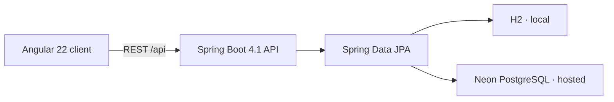

<div align="center">

# HelpHive

**A modern community help exchange built with Spring Boot, Angular, and PostgreSQL.**

[Features](#features) · [Run locally](#run-locally) · [API](#api) · [Deploy free](#deploy-free) · [Tech stack](#tech-stack)

</div>

## What is HelpHive?

HelpHive makes it easy for neighbors to request a hand or offer their time and skills. People can browse a live community board, search by keyword or location, filter by category and status, contact one another, and follow a post from open to completed.

This is a complete full-stack project rather than a portfolio or static demo. The Angular client talks to a tested Spring Boot REST API, data is persisted with JPA, and the whole application deploys as one Docker service.

## Features

- Create, read, edit, and delete community posts
- Request help or offer a skill
- Keyword, category, type, and status filters
- Open → in progress → completed workflow
- Live community-impact statistics
- Responsive custom UI for desktop, tablet, and mobile
- Form validation on both client and server
- Friendly API validation and error responses
- H2 zero-configuration local database
- PostgreSQL support for hosted data
- Demo seed data on an empty database
- Spring Boot health endpoint for hosting checks
- Backend integration tests and Angular component tests
- GitHub Actions continuous integration
- Multi-stage production Docker build
- Render Blueprint for one-click infrastructure setup

## Architecture



The production Docker image builds Angular first, copies the static bundle into Spring Boot, and serves the UI and API from the same URL. That keeps the free deployment simple and avoids cross-origin configuration.

## Tech stack

| Layer | Technology |
| --- | --- |
| Frontend | Angular 22, TypeScript 6, RxJS, SCSS, reactive forms, signals |
| Backend | Java 21, Spring Boot 4.1, Spring Web MVC, Bean Validation |
| Data | Spring Data JPA, Hibernate, H2, PostgreSQL |
| Quality | JUnit 6, MockMvc, Vitest, GitHub Actions |
| Delivery | Docker, Render Blueprint, Neon Postgres |

## Run locally

### Requirements

- Java 21
- Node.js 24+

Maven does not need to be installed; the repository includes Maven Wrapper.

### 1. Start the API

```bash
cd backend
./mvnw spring-boot:run
```

On Windows PowerShell, use `./mvnw.cmd spring-boot:run`.

The API runs at `http://localhost:8080`. H2 runs in memory and six sample posts are added automatically.

### 2. Start Angular

In a second terminal:

```bash
cd frontend
npm install
npm start
```

Open `http://localhost:4200`. The Angular development server proxies `/api` to Spring Boot.

### Run checks

```bash
cd backend
./mvnw verify

cd ../frontend
npm test -- --watch=false
npm run build
```

## API

Base path: `/api/posts`

| Method | Endpoint | Purpose |
| --- | --- | --- |
| `GET` | `/api/posts` | List and filter posts |
| `GET` | `/api/posts/{id}` | Get one post |
| `GET` | `/api/posts/stats` | Get community statistics |
| `POST` | `/api/posts` | Create a post |
| `PUT` | `/api/posts/{id}` | Replace post details |
| `PATCH` | `/api/posts/{id}/status` | Change post status |
| `DELETE` | `/api/posts/{id}` | Delete a post |

List filters are optional query parameters: `search`, `category`, `type`, and `status`.

Example:

```http
GET /api/posts?search=laptop&category=TECHNOLOGY&status=OPEN
```

Health check: `GET /actuator/health`

## Deploy free

The easiest setup uses one free Render web service and one free Neon PostgreSQL database. The included `render.yaml` and `Dockerfile` do the full Angular + Java build.

### 1. Put the project on GitHub

Create an empty public repository, then run from this folder:

```bash
git remote add origin https://github.com/YOUR_USERNAME/helphive.git
git branch -M main
git push -u origin main
```

### 2. Create the free database

1. Create a free project at [Neon](https://neon.com/).
2. Open **Connect** and keep the host, database, username, and password.
3. Convert the connection to this JDBC form:

```text
jdbc:postgresql://YOUR_NEON_HOST/YOUR_DATABASE?sslmode=require
```

### 3. Deploy on Render

1. Sign in to [Render](https://render.com/) with GitHub.
2. Choose **New → Blueprint**.
3. Select the HelpHive repository. Render detects `render.yaml`.
4. Choose the **Free** instance and enter the prompted variables:

| Variable | Value |
| --- | --- |
| `DATABASE_URL` | The JDBC URL from step 2 |
| `DATABASE_USERNAME` | Your Neon role/user |
| `DATABASE_PASSWORD` | Your Neon password |

5. Apply the Blueprint and wait for the first Docker build.

Render gives the app a free `https://...onrender.com` URL and automatically redeploys after pushes to `main`. Free Render services sleep after inactivity, so the first request after a quiet period can take about a minute. The database remains external in Neon, so data is not lost when the service sleeps or redeploys.

> Never commit a real database password. The Blueprint marks all database values as secrets and asks for them in Render.

## Project structure

```text
helphive/
├── .github/workflows/ci.yml    # build and test on every push/PR
├── backend/                    # Spring Boot REST API
│   ├── src/main/java/          # controller, service, repository, entities
│   ├── src/main/resources/     # local/hosted configuration
│   └── src/test/               # MockMvc integration tests
├── frontend/                   # Angular single-page application
│   └── src/app/                # UI, model, and API service
├── Dockerfile                  # production multi-stage build
└── render.yaml                 # free-hosting Blueprint
```

## Ideas for the next version

- Spring Security login and role-based ownership
- Image uploads with object storage
- Map-based distance filtering
- Email notifications
- Moderation and reporting
- Pagination for larger communities

## License

Released under the [MIT License](LICENSE).
